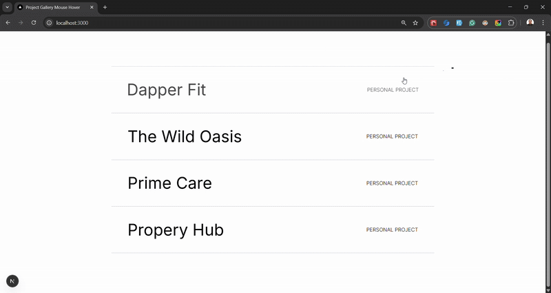

## Project Gallery Mouse Hover

A project gallery project featuring a hover animation using Nextjs, GSAP and Framer Motion. Inspired by: https://dennissnellenberg.com/



### Usage

### Clone the Repository

```bash
git clone https://github.com/arvinbuid/project-gallery-mouse-hover.git
```

#### Install npm dependencies

```bash
npm install
```

### Run in development mode

```bash
npm run dev
```

Open [http://localhost:3000](http://localhost:3000) with your browser to see the result.
